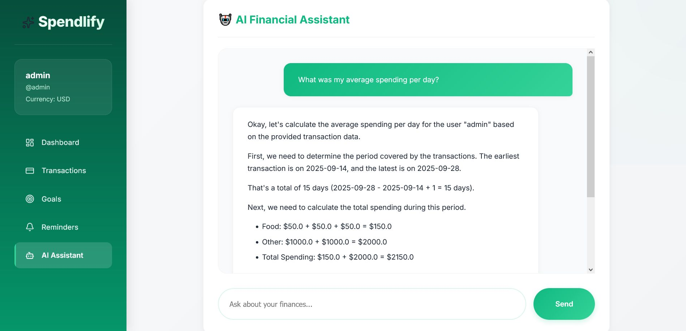

# 🚀 Spendlify - AI-Powered Financial Intelligence Platform

<div align="center">


### *Where Artificial Intelligence Meets Personal Finance*

**🤖 AI-Driven Insights** • **📊 Real-Time Analytics** • **🌍 Multi-Currency Support** • **🔐 Enterprise-Grade Security**

[View Demo](#-live-demo) • [Features](#-core-features) • [Tech Stack](#-technology-stack) • [Get Started](#-quick-start)

</div>

---

## 🎯 Summary

**Spendlify** is a personal finance management platform that leverages **Google's Gemini 2.0 Flash AI** to deliver intelligent financial insights and recommendations. Built with modern web technologies and a robust Python backend, it demonstrates advanced software engineering principles including RESTful API design, secure authentication, real-time data processing, and conversational AI integration.

### 🏆 Key Differentiators

- **🤖 AI-First Architecture**: using Google Gemini 2.0
- **🔄 Dual Interface Design**: Full-featured CLI and modern web application
- **📊 Real-Time Analytics**: Dynamic dashboards with interactive visualizations
- **🌐 Production-Ready**: RESTful API, session management, and comprehensive error handling
- **🎨 Modern UX**: Glass-morphism design, responsive layouts, and smooth animations

---

## 🎯 Core Features

### 💳 **Transaction Management System**
- **Full CRUD Operations**: Create, Read, Update, Delete with validation
- **Multi-Currency Support**: USD, EUR, GBP, JPY, EGP with real-time conversion context
- **Smart Categorization**: Automated category suggestions (Food, Transport, Bills, Shopping, Other)
- **Payment Tracking**: Cash vs. Credit Card analytics
- **CSV Import/Export**: Bulk operations with error handling and validation
- **Advanced Search**: Filter by date range, category, amount, with sorting options

### 📊 **Real-Time Analytics Dashboard**
- **Interactive Charts**: Chart.js powered visualizations
- **Financial Summary Cards**: Income, Expenses, Net Balance with trend indicators
- **Category Breakdown**: Pie charts and percentage analysis
- **Monthly Trends**: Historical data visualization
- **Top Spending Categories**: Ranked by amount and frequency

### 🎯 **Goal Tracking System**
- **Progress Monitoring**: Real-time percentage calculations
- **Deadline Management**: Automatic status updates (active/completed)
- **Visual Indicators**: Progress bars and achievement notifications
- **Flexible Adjustments**: Update targets and current amounts dynamically

### 🔔 **Intelligent Bill Reminders**
- **Automated Notifications**: 5-day advance warnings
- **Overdue Tracking**: Calculates days past due
- **Payment History**: Complete audit trail
- **Dashboard Integration**: Upcoming bills prominently displayed

### 🔐 **Enterprise-Grade Security**
- **SHA-256 Password Hashing**: Industry-standard encryption
- **Strong Password Policy**: Enforced complexity requirements
- **Session Management**: Secure token-based authentication
- **Data Isolation**: User-specific data filtering at query level
- **Input Validation**: Frontend and backend sanitization

## 💻 Technology Stack

### **Backend Architecture**
```python
🐍 Python 3.11+          # Core language
🌶️  Flask 3.0+           # Web framework & REST API
🤖 Google Gemini 2.0     # AI/ML integration
🔐 Hashlib (SHA-256)     # Cryptographic hashing
📊 CSV/JSON              # Data persistence
🔄 Python-dotenv         # Environment management
```

### **Frontend Stack**
```javascript
🎨 HTML5/CSS3            # Modern semantic markup
⚡ Vanilla JavaScript    # No framework dependencies
📊 Chart.js 4.4.0        # Data visualization
🎭 Lucide Icons          # SVG icon library
🎪 Glass-morphism UI     # Modern design system
📱 Responsive Design     # Mobile-first approach
```

---

## 🤖 AI-Powered

<div align="center">



### **Conversational Financial Intelligence at Your Fingertips**

</div>

Spendlify's AI assistant, powered by **Google Gemini 2.0 Flash**, transforms complex financial data into actionable insights through natural language conversations.

### 🧠 AI Capabilities

#### **Natural Language Processing**
```
You: "How much did I spend on food this month?"
AI: "You spent $143.65 on food this month, which is 15% higher than last month..."
```

#### **Context-Aware Analysis**
- **Transaction History Integration**: AI analyzes your last 5 transactions for context
- **Temporal Awareness**: Understands current date and time-based queries
- **User-Specific Insights**: Personalized recommendations based on spending patterns
- **Multi-Currency Intelligence**: Handles queries across different currencies

#### **Smart Financial Advisor**
- 💡 **Spending Pattern Recognition**: Identifies trends and anomalies
- 📊 **Budget Recommendations**: Suggests optimal budget allocations
- 🎯 **Goal Achievement Strategies**: Provides actionable steps to reach financial goals
- ⚠️ **Proactive Alerts**: Warns about unusual spending or upcoming bills

#### **Technical Implementation**
```python
# AI Integration Architecture
- API: Google Gemini 2.0 Flash (generativelanguage.googleapis.com)
- Context Building: Dynamic prompt engineering with user transaction data
- Real-time Processing: Asynchronous request handling
- Error Handling: Comprehensive exception management
- Security: API key management via environment variables
```

---

## 🚀 Quick Start

### **Installation**

```bash
# Clone the repository
git clone https://github.com/albert429/Spendlify.git
cd Spendlify

# Install dependencies
pip install flask requests python-dotenv

# Configure environment variables
echo "GEMINI_API_KEY=your_gemini_api_key_here" > .env

# Launch Web Application (Recommended)
python app.py
# Access at: http://localhost:5001

# OR Launch CLI Application
python main_menu.py
```

### **Get Your Gemini API Key**
1. Visit [Google AI Studio](https://makersuite.google.com/app/apikey)
2. Create a new API key
3. Add to `.env` file

---

## 🎬 Usage Examples

### **AI Assistant Conversations**

```
💬 User: "What's my spending trend this month?"
🤖 AI: "Based on your transactions, you've spent $1,247.50 this month. 
       This is 12% higher than last month, primarily due to increased 
       spending in the Shopping category (+$150)."

💬 User: "Should I be worried about my expenses?"
🤖 AI: "Your expense-to-income ratio is 62%, which is within healthy 
       limits. However, I notice your Bills category has increased. 
       Consider reviewing your subscriptions."

💬 User: "Help me save $500 by next month"
🤖 AI: "To save $500, I recommend: 1) Reduce dining out by 30% ($120), 
       2) Use public transport instead of taxis ($80), 3) Review and 
       cancel unused subscriptions ($50). This leaves $250 from your 
       current surplus."
```

### **API Usage**

```python
# Example: Query AI Assistant via API
import requests

response = requests.post('http://localhost:5001/api/ai/chat', 
    json={'question': 'Analyze my spending patterns'},
    headers={'Cookie': 'session=your_session_token'}
)

print(response.json()['response'])
```

---

### 🌟 **If you find this project interesting, please consider giving it a star!**

[](https://github.com/albert429/Spendlify)

---

**Built with 💚 and ☕ | Powered by AI 🤖**

*"Where intelligent code meets intelligent finance"*

</div>


